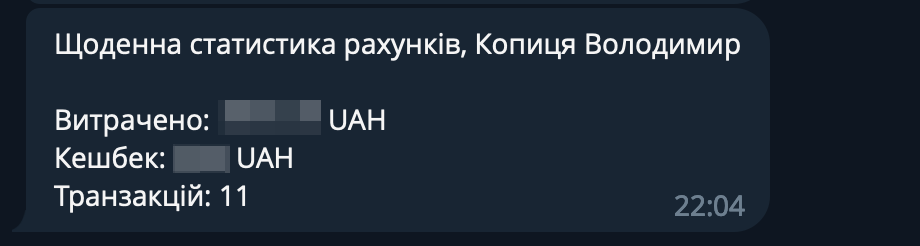

# Monobank personal telegram bot

A simple telegram bot, written in Go with the [telegram-bot-api](https://github.com/go-telegram-bot-api/telegram-bot-api 'telegram-bot-api') library.

### Report

### WebHook

### Balance

## Usage

Run `mono_personal_tgbot` execution file in your terminal with following env variables

 Environment variable    | Description
------------------------ | -----------------------------------------------------------
`TELEGRAM_TOKEN`         | [How to get telegram bot token](https://core.telegram.org/bots#3-how-do-i-create-a-bot)
`TELEGRAM_ADMINS`        | ids of the trusted user, example: `1234567,1234567`
`TELEGRAM_CHATS`         | ids of the trusted chats, example: `-1234567,-1234567`
`MONO_TOKENS`            | list of the tokens and it is `number`. [How to get monobank token](https://api.monobank.ua/)

### Telegram commands

 Command                 | Description
------------------------ | -----------------------------------------------------------
`/balance[_n]`           | Get `UAH` balance of the default client or first one or by number. example: `/balance`, `/balance_1`
`/report`                | Get a report for the period of the default client or first one or by number. example: `/report`, `/report_1`
`/get_webhook[_n]`       | Get a status about setup webhook of the default client or first one or by number. example: `/get_webhook`, `/get_webhook_1`
`/set_webhook[_n]`       | Set webhook url to monobank api of the default client or first one or by number. example: `/set_webhook`, `/set_webhook_1`

## Usage with docker-compose

Rename `.env.dev` file to `.env` and edit.

    # docker-compose up -d

## Download
[v0.2 release, Linux](https://github.com/vkopitsa/mono_personal_tgbot/releases/download/v0.2/mono_personal_tgbot-linux-amd64)

[v0.2 release, MacOS](https://github.com/vkopitsa/mono_personal_tgbot/releases/download/v0.2/mono_personal_tgbot-darwin-amd64)

[v0.2 release, Windows](https://github.com/vkopitsa/mono_personal_tgbot/releases/download/v0.2/mono_personal_tgbot-windows-amd64.exe)

## Compatibility
The bot is only available for Windows, Linux, MacOS.

### Licence
The bot is available under the MIT license. See the [LICENSE file](https://github.com/vkopitsa/mono_personal_tgbot/blob/master/LICENSE) for more info.
